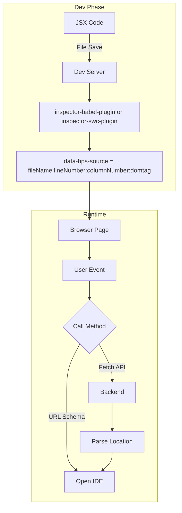

<h1 align="center">Hyperse Code Inspector</h1>
<p align="left">
  <a aria-label="Build" href="https://github.com/hyperse-io/code-inspector/actions?query=workflow%3ACI">
    
  </a>
  <a aria-label="stable version" href="https://www.npmjs.com/package/@hyperse/inspector">
    
  </a>
  <a aria-label="Top language" href="https://github.com/hyperse-io/code-inspector/search?l=typescript">
    
  </a>
  <a aria-label="Licence" href="https://github.com/hyperse-io/code-inspector/blob/main/LICENSE">
    
  </a>
</p>

<p align="center">
  <strong>@hyperse/inspector</strong> is the tool for seamlessly navigating from your browser to your IDE.
  <br />
  With <strong>just a simple click</strong>, you can jump from a React component in the browser to its source code in your local IDE instantly.
  <br />
  Think of it as a supercharged version of Chrome's Inspector, tailored for developers.
</p>

## Table of Contents

- [Why @hyperse/inspector?](#why-hyperseinspector)
- [Key Features](#key-features)
- [Default Hotkeys](#default-hotkeys)
- [Quick Look](#quick-look)
- [Installation](#installation)
- [How to Use and Configure](#how-to-use-and-configure)
  - [Step 1: Install Packages](#step-1-install-packages)
  - [Step 2: Add the Inspector Component to Your App](#step-2-add-the-inspector-component-to-your-app)
  - [Step 3: Configure the Build Tool Plugin (Babel or SWC)](#step-3-configure-the-build-tool-plugin-babel-or-swc)
  - [Step 4: Configure the Dev Server Middleware](#step-4-configure-the-dev-server-middleware)
    - [Webpack](#webpack)
    - [Vite](#vite)
    - [Rspack](#rspack)
    - [Next.js](#nextjs)
- [Customization](#customization)
  - [Custom Hotkeys](#custom-hotkeys)
  - [Controlled Mode](#controlled-mode)
- [How It Works](#how-it-works)
- [Supported IDEs/Editors](#supported-ideseditors)
- [Troubleshooting](#troubleshooting)
- [Contributing](#contributing)
- [License](#license)
- [Acknowledgements](#acknowledgements)

## Why @hyperse/inspector?

Have you ever run into any of these issues 🤔:

- You need to fix bugs in a team project, but you're lost trying to find where the page/component's code is located.
- You're excited to explore an open-source project, but struggle to pinpoint the implementation of a specific page or component.
- You're thinking about a component and want a quick peek at its code, without memorizing or manually navigating through deeply nested file paths.

That's exactly why **@hyperse/inspector** was created – to make your development workflow smoother and more efficient!

## Key Features

- ✨ **Instant Code Navigation:** Click on a UI element in the browser and jump directly to its source code in your IDE.
- 🔌 **IDE Integration:** Launches your configured IDE/Editor pointing to the exact file and line number.
- 🛠️ **Multi-framework Support:** Works with popular bundlers and frameworks like Vite, Webpack, Rspack, and more.
- 🚀 **Native SWC Plugin:** Includes a high-performance SWC plugin for projects using SWC.
- ⚛️ **React 19 Ready:** Compatible with the latest React versions, including React 19.
- ⌨️ **Customizable Hotkeys:** Change the activation hotkey to fit your preferences.
- 🌍 **Universal:** Designed to work with various project setups.

### Default Hotkeys

- macOS: `⌘ + i`
- Windows/Linux: `Ctrl + i`

You can customize the hotkeys by passing the `keys` prop to the `<Inspector/>` component.

## Installation

Choose your preferred package manager:

```bash
# npm
npm install --save-dev @hyperse/inspector @hyperse/inspector-middleware @hyperse/inspector-babel-plugin # or @hyperse/inspector-swc-plugin
# For Next.js projects, also install:
npm install --save-dev @hyperse/next-inspector

# yarn
yarn add --dev @hyperse/inspector @hyperse/inspector-middleware @hyperse/inspector-babel-plugin # or @hyperse/inspector-swc-plugin
# For Next.js projects, also install:
yarn add --dev @hyperse/next-inspector

# pnpm
pnpm add --save-dev @hyperse/inspector @hyperse/inspector-middleware @hyperse/inspector-babel-plugin # or @hyperse/inspector-swc-plugin
# For Next.js projects, also install:
pnpm add --save-dev @hyperse/next-inspector
```

## How to Use and Configure

Setting up `@hyperse/inspector` involves a few steps:

### Step 1: Install Packages

(Covered in the [Installation](#installation) section above.) Make sure you install:

1.  `@hyperse/inspector`: The core React component.
2.  `@hyperse/inspector-middleware`: The dev server middleware.
3.  Either `@hyperse/inspector-babel-plugin` (for Babel users) or `@hyperse/inspector-swc-plugin` (for SWC users).
4.  For Next.js projects, also install:
    - `@hyperse/next-inspector`: The Next.js plugin

### Step 2: Add the Inspector Component to Your App

Import and render the `<Inspector />` component in your application's root or main layout component. It's a good practice to only include it during development.

```tsx
// src/App.tsx or your main layout component
import { Inspector } from '@hyperse/inspector';
import { useState } from 'react'; // Optional: for controlled mode

export default function App() {
  // Optional: for controlled mode
  const [inspectorActive, setInspectorActive] = useState(false);

  // Conditionally render the Inspector only in development
  const isDevelopment = process.env.NODE_ENV === 'development';

  return (
    <div>
      {isDevelopment && (
        <Inspector
        // Optional: Customize hotkeys
        // keys={['Control', 'Shift', 'i']}
        // Optional: Controlled mode
        // active={inspectorActive}
        // onActiveChange={setInspectorActive}
        />
      )}
      {/* Your other application components */}
    </div>
  );
}
```

### Step 3: Configure the Build Tool Plugin (Babel or SWC)

This plugin injects necessary source location information into your JSX elements during the build process.

#### For Babel Users (`@hyperse/inspector-babel-plugin`)

Add `@hyperse/inspector-babel-plugin` to your Babel configuration (e.g., `babel.config.js` or `.babelrc.js`).

```javascript
// babel.config.js
module.exports = {
  presets: [
    '@babel/preset-env',
    '@babel/preset-typescript',
    ['@babel/preset-react', { runtime: 'automatic' }],
  ],
  plugins: [
    // Add the inspector plugin only in development mode
    process.env.NODE_ENV === 'development' && '@hyperse/inspector-babel-plugin',
    // Filter out falsy values in case NODE_ENV is not 'development'
  ].filter(Boolean),
};
```

#### For SWC Users (`@hyperse/inspector-swc-plugin`)

Add `@hyperse/inspector-swc-plugin` to your SWC configuration (e.g., `.swcrc` or within your bundler's SWC loader options).

**Example for `.swcrc`:**

```json
{
  "jsc": {
    "parser": {
      "syntax": "typescript",
      "tsx": true
    },
    "transform": {
      "react": {
        "runtime": "automatic"
      }
    },
    "experimental": {
      "plugins": [["@hyperse/inspector-swc-plugin", {}]]
    }
  }
}
```

_Note: Ensure the SWC plugin is only applied in development if configuring through bundler options._

### Step 4: Configure the Dev Server Middleware

The middleware listens for requests from the inspector component and launches your IDE.

#### Next.js

For Next.js projects, you can use the official `@hyperse/next-inspector` plugin. Here's how to configure it:

```javascript
// next.config.mjs
import { resolve } from 'path';
import { createNextConfig } from '@hyperse/next-config';
import withNextInspector from '@hyperse/next-inspector/plugin';

const plugins = [
  withNextInspector({
    projectCwd: resolve(process.cwd()),
    trustedEditor: 'cursor', // or 'vscode', 'webstorm', etc.
    customLaunchEditorEndpoint: '/hps_inspector',
    keys: ['$mod', 'g'], // Customize hotkeys
    hideDomPathAttr: false,
  }),
];

const nextConfig = {
  // Your Next.js config options
};

export default createNextConfig(nextConfig, plugins);
```

Key configuration options for Next.js:

- `projectCwd`: Your project's root directory
- `trustedEditor`: Your preferred IDE (e.g., 'cursor', 'vscode', 'webstorm')
- `customLaunchEditorEndpoint`: Custom endpoint for launching the editor
- `keys`: Custom hotkey configuration
- `hideDomPathAttr`: Whether to hide DOM path attributes in production

#### Webpack

In your `webpack.config.js` (or equivalent for development):

```javascript
// webpack.config.js
const { createInspectorMiddleware } = require('@hyperse/inspector-middleware');

module.exports = (env, argv) => {
  const isDev = argv.mode === 'development';

  return {
    // ... other webpack config
    devServer: {
      // ... other devServer config
      setupMiddlewares: (middlewares, devServer) => {
        if (isDev) {
          /**
           * @hyperse/inspector server middleware
           */
          middlewares.unshift(createInspectorMiddleware({}));
        }
        // Your other middlewares
        return middlewares;
      },
    },
    module: {
      rules: [
        // Example for Babel loader (ensure Step 3 is configured)
        {
          test: /\.(js|jsx|ts|tsx)$/,
          exclude: /node_modules/,
          use: {
            loader: 'babel-loader',
            // Babel options can be here or in babel.config.js
          },
        },
        // Example for SWC loader (ensure Step 3 is configured if using .swcrc, or configure plugin here)
        // {
        //   test: /\.tsx?$/,
        //   exclude: /node_modules/,
        //   use: {
        //     loader: 'swc-loader', // or 'builtin:swc-loader' for Rspack/Turbopack
        //     options: { // SWC options, including the plugin if not using .swcrc
        //       jsc: {
        //         experimental: {
        //           plugins: isDev ? [['@hyperse/inspector-swc-plugin', {}]] : [],
        //         },
        //         // ... other jsc options
        //       },
        //     },
        //   },
        // },
      ],
    },
    // ... other webpack config
  };
};
```

#### Vite

In your `vite.config.ts` (or `.js`):

```typescript
// vite.config.ts
import { defineConfig } from 'vite';
import react from '@vitejs/plugin-react';
import { createInspectorMiddleware } from '@hyperse/inspector-middleware'; // Corrected package

export default defineConfig(({ mode }) => {
  const isDevelopment = mode === 'development';

  return {
    plugins: [
      react({
        // If using Babel for JSX transformation with Vite:
        babel: {
          plugins: [isDevelopment && '@hyperse/inspector-babel-plugin'].filter(
            Boolean
          ),
        },
        // If using SWC (default for @vitejs/plugin-react v3+),
        // ensure @hyperse/inspector-swc-plugin is in your .swcrc
        // or configure it via swc options if available in plugin-react.
      }),
      // Middleware for @hyperse/inspector
      isDevelopment && {
        name: 'hyperse-inspector-middleware',
        configureServer(server) {
          server.middlewares.use(createInspectorMiddleware({}));
        },
      },
    ].filter(Boolean),
    // ... other Vite config
  };
});
```

_For SWC with Vite: If `@vitejs/plugin-react` uses SWC, ensure `@hyperse/inspector-swc-plugin` is configured in your project's `.swcrc` file. Vite's React plugin will pick it up._

#### Rspack

In your `rspack.config.js` (or equivalent for development):

```javascript
// rspack.config.js
const { createInspectorMiddleware } = require('@hyperse/inspector-middleware');

module.exports = (env, argv) => {
  const isDev = process.env.NODE_ENV === 'development'; // Rspack often uses NODE_ENV

  return {
    // ... other Rspack config
    devServer: {
      // ... other devServer config
      setupMiddlewares: (middlewares, devServer) => {
        if (isDev) {
          /**
           * @hyperse/inspector server middleware
           */
          middlewares.unshift(createInspectorMiddleware({}));
        }
        // Your other middlewares
        return middlewares;
      },
    },
    module: {
      rules: [
        // Example for builtin:swc-loader (ensure Step 3 is configured for SWC)
        {
          test: /\.(js|jsx|ts|tsx)$/,
          exclude: /node_modules/,
          loader: 'builtin:swc-loader',
          options: {
            jsc: {
              parser: { syntax: 'typescript', tsx: true },
              transform: { react: { runtime: 'automatic' } },
              experimental: {
                plugins: isDev ? [['@hyperse/inspector-swc-plugin', {}]] : [],
              },
            },
          },
        },
      ],
    },
    // ... other Rspack config
  };
};
```

## Customization

### Custom Hotkeys

You can customize the activation hotkeys by passing the `keys` prop to the `<Inspector />` component.
The `keys` prop accepts an array of strings representing `KeyboardEvent.key` values.

```tsx
<Inspector keys={['Shift', 'Alt', 'c']} />
```

This will set the hotkey to `Shift + Alt + c`.

### Controlled Mode

For more fine-grained control over the inspector's visibility, you can use the `active` and `onActiveChange` props.

```tsx
import { Inspector } from '@hyperse/inspector';
import { useState } from 'react';

function MyComponent() {
  const [showInspector, setShowInspector] = useState(false);

  return (
    <>
      <button onClick={() => setShowInspector(!showInspector)}>
        Toggle Inspector Programmatically
      </button>
      <Inspector
        active={showInspector}
        onActiveChange={setShowInspector}
        // You can still provide custom keys or use default
      />
    </>
  );
}
```

## How It Works

Here's a simplified overview of the `@hyperse/inspector` pipeline:



<br/>

1.  **Part 0: JSX Source Information (Build-time)**

    - This step is typically handled by your existing React setup (e.g., via Babel's `babel-plugin-transform-react-jsx-source` or SWC's equivalent functionality). It adds `__source` (file path, line number) debug information to JSX elements.
    - The `@hyperse/inspector-babel-plugin` or `@hyperse/inspector-swc-plugin` leverages this or injects similar information, ensuring it's consistently available and formatted for the inspector.

2.  **Part 1: Inspector Component (Client-side)**

    - The `<Inspector />` component, when activated (e.g., by hotkey), allows you to select an element on the page.
    - Upon selection, it reads the source location information (file path, line, column) embedded in the selected React component's DOM element or Fiber node.
    - It then sends an API request to your development server, containing this source path information.

3.  **Part 2: Dev Server Middleware (Server-side)**
    - The `@hyperse/inspector-middleware` (e.g., `createInspectorMiddleware`) runs on your development server.
    - It listens for API requests from the client-side Inspector.
    - When it receives a request, it uses a launcher utility (like `launch-editor`) to open the specified source file in your configured local IDE/Editor, navigating directly to the correct line and column.

## Supported IDEs/Editors

`@hyperse/inspector` uses `launch-editor` (or a similar mechanism) under the hood, which supports a wide range of popular IDEs and editors. Commonly supported ones include:

- Visual Studio Code (VS Code)
- WebStorm / IntelliJ IDEA / PhpStorm / PyCharm (and other JetBrains IDEs)
- Sublime Text
- Atom
- Vim / Neovim
- Emacs
- And more...

Ensure your chosen IDE is correctly configured in your system's environment variables (e.g., `LAUNCH_EDITOR` or `EDITOR`) or that its command-line interface (CLI) is in your system's `PATH`. For VS Code, simply having `code` in your PATH is usually sufficient.

## Troubleshooting

- **Inspector not opening files / "Editor not found":**
  - Ensure your IDE's command-line tool is installed and added to your system's PATH (e.g., `code` for VS Code).
  - You might need to set the `LAUNCH_EDITOR` or `EDITOR` environment variable. For example, in your `.bashrc` or `.zshrc`:
    ```bash
    export LAUNCH_EDITOR=code # For VS Code
    # export LAUNCH_EDITOR=webstorm # For WebStorm
    ```
  - Restart your development server and terminal after making changes to environment variables.
- **Component source not found / incorrect location:**
  - Verify that the Babel or SWC plugin is correctly configured and running only in development mode.
  - Ensure source maps are being generated correctly if the plugin relies on them indirectly.
  - Check for any conflicting Babel/SWC plugins that might interfere with source information.

## License

This project is licensed under the [MIT LICENSE](./LICENSE).

## Acknowledgements

This project draws inspiration from other great tools in the developer ecosystem aimed at improving debugging and code navigation, such as `react-dev-inspector`.

---
